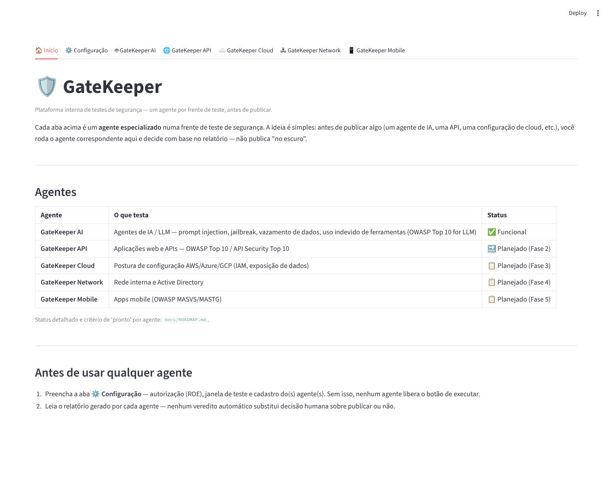
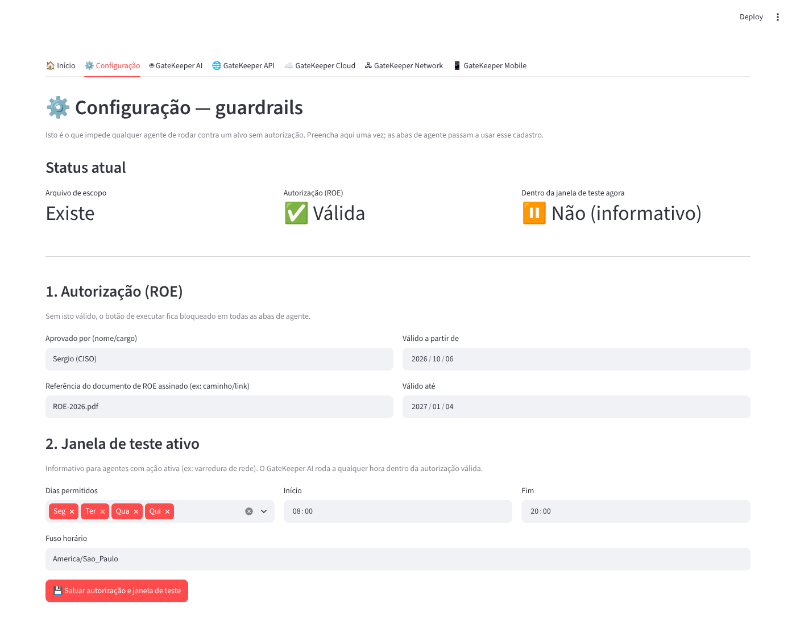
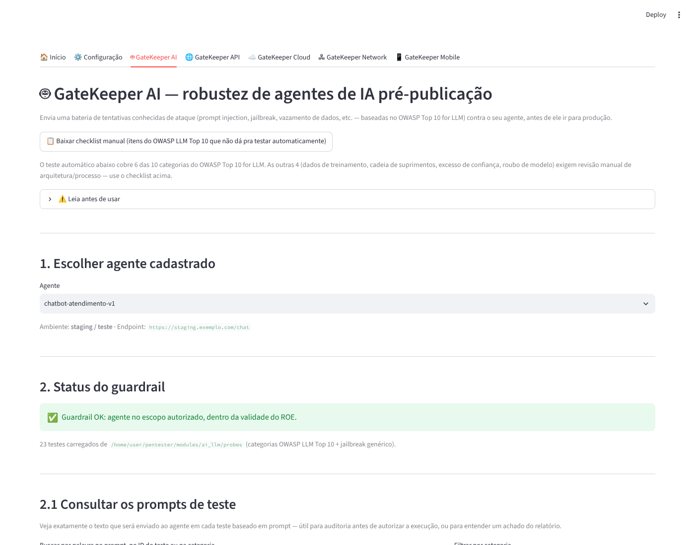
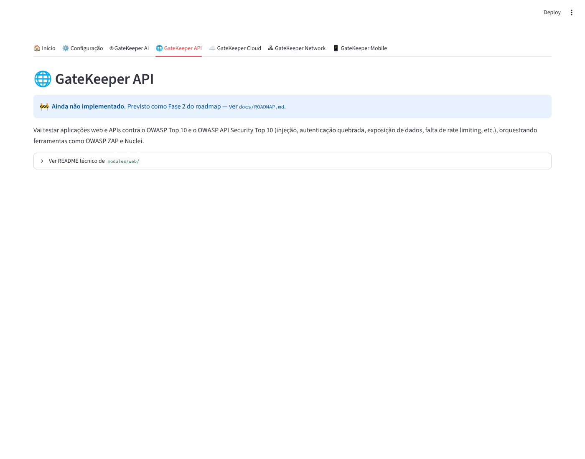

# GateKeeper — Plataforma interna de testes de segurança

Plataforma para orquestrar testes de segurança **internos e autorizados**,
organizada em um agente por frente de teste, reduzindo a dependência de
consultorias externas. Mantida pelo CISO da empresa.

| Agente | Frente de teste | Status |
|---|---|---|
| **GateKeeper AI** | Agentes de IA / LLM (OWASP Top 10 for LLM) | ✅ Funcional |
| **GateKeeper API** | Web / APIs (OWASP Top 10, API Security Top 10) | 🔜 Fase 2 |
| **GateKeeper Cloud** | Postura de configuração AWS/Azure/GCP | 📋 Fase 3 |
| **GateKeeper Network** | Rede interna / Active Directory | 📋 Fase 4 |
| **GateKeeper Mobile** | Apps mobile (OWASP MASVS/MASTG) | 📋 Fase 5 |

> ⚠️ Isto não é uma ferramenta de "hacking automático". É um orquestrador
> de testes com **guardrails obrigatórios**: nenhuma ação ativa roda contra
> um alvo que não esteja explicitamente listado em `config/scope.yaml`,
> dentro da janela de teste autorizada.

## Telas

**Início** — explica a plataforma e lista o status de cada agente:



**Configuração** — autorização (ROE), janela de teste, cadastro de agentes e trilha de auditoria. É o que faz o guardrail valer de verdade:



**GateKeeper AI** — o único agente funcional hoje, testando um agente de IA cadastrado:



**Agentes ainda não implementados** (GateKeeper API/Cloud/Network/Mobile) aparecem como placeholder honesto, nunca fingindo ter funcionalidade que não existe:



## Estrutura

```
api/                API HTTP (FastAPI) sobre a mesma lógica — ver api/README.md
config/            Escopo autorizado, janelas de teste, exclusões
core/               Guardrails, orquestrador, modelo de scope
docs/
  ROE_TEMPLATE.md   Modelo de Regras de Engajamento / autorização formal
  ROADMAP.md        Fases de implementação e status de cada módulo
  LOVABLE_PROMPT.md Prompt pronto pra gerar um frontend alternativo no Lovable
modules/
  recon/            Reconhecimento passivo/ativo de superfície
  web/              Testes OWASP Top 10 / API Security Top 10 (Fase 1 — ativo)
  cloud/            Postura de configuração AWS/Azure/GCP (Fase 2)
  network/          Varredura de rede interna e AD (Fase 3)
  mobile/           OWASP MASVS / MASTG (Fase 4)
  ai_llm/           OWASP Top 10 for LLM Applications (Fase 5)
  reporting/        Geração de relatório consolidado
```

## Frontend alternativo (Lovable)

A tela Streamlit (`ui/app.py`) não é a única forma de usar o
GateKeeper. `api/` expõe a mesma lógica (guardrails, cadastro de
agentes, execução de teste, relatório) como API HTTP, pra quem quiser
um frontend mais visual — como o gerado pelo [Lovable](https://lovable.dev).

- `api/README.md` — endpoints disponíveis e como rodar a API.
- `docs/LOVABLE_PROMPT.md` — prompt pronto pra colar no Lovable.

O princípio não muda: a lógica de autorização continua só em
`core/guardrails.py`. Nenhum frontend (Streamlit, Lovable ou outro)
decide sozinho se uma execução é permitida.

## Instalação

Precisa ser feito uma vez, num computador (o seu ou de alguém de TI).
Depois disso, abrir a tela no dia a dia é só um comando (ver "Modo
tela" abaixo).

### Passo 1 — Ter o Python instalado

Verifique se já tem, abrindo o terminal (Mac/Linux) ou PowerShell
(Windows) e digitando:

```bash
python3 --version
```

Se aparecer algo como `Python 3.11.x`, já está instalado, pule pro
Passo 2. Se der erro, baixe em **python.org/downloads** (marque a
opção "Add Python to PATH" se for Windows) e instale antes de
continuar.

### Passo 2 — Baixar o código deste projeto

```bash
git clone https://github.com/scastanho78/gatekeeper.git
cd gatekeeper
```

Se não tiver o `git` instalado, dá pra baixar direto pelo navegador:
em https://github.com/scastanho78/gatekeeper clique em **Code → Download
ZIP**, extraia a pasta, e abra o terminal dentro dela.

### Passo 3 — Instalar as dependências

Dentro da pasta `gatekeeper`, rode:

```bash
python3 -m venv .venv
source .venv/bin/activate      # no Windows: .venv\Scripts\activate
pip install -r requirements.txt
```

Isso instala tudo que o projeto precisa (demora um a dois minutos, só
na primeira vez).

### Passo 4 — Abrir a tela

```bash
streamlit run ui/app.py
```

Uma aba abre automaticamente no navegador em `http://localhost:8501`
com o formulário (nome do agente, endereço/URL, chave de API, botão
"Rodar teste de verdade"). Não precisa editar nenhum arquivo nem usar
mais o terminal depois disso — só deixar essa janela do terminal
aberta enquanto estiver usando a tela.

Para abrir de novo em outro dia, dentro da pasta `gatekeeper`:

```bash
source .venv/bin/activate      # no Windows: .venv\Scripts\activate
streamlit run ui/app.py
```

## Pré-requisitos antes de usar em qualquer alvo real

1. `config/scope.yaml` preenchido e revisado — todo alvo fora dele é
   bloqueado pelo guardrail (`core/guardrails.py`).
2. Documento de autorização assinado (ver `docs/ROE_TEMPLATE.md`) com
   escopo, janela de execução e contato de emergência.
3. Nenhum módulo de varredura **ativa** roda sem o CISO (ou quem ele
   delegar) confirmar execução manualmente (`--confirm`).

## Status

Ver `docs/ROADMAP.md` para o que está implementado vs. planejado.
